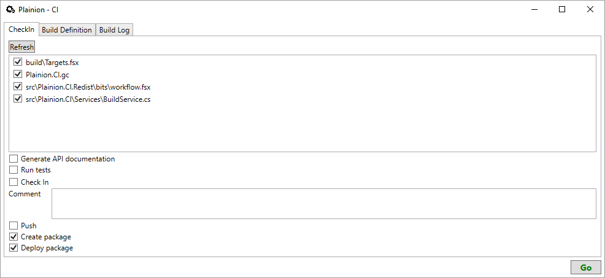

This project provides tools for build automation, continuous integration and continuous delivery.

# Motivation

Nowadays continuous delivery is a must for every project. Short cycle times for new features and 
bug fixes - from code change till a new release is published - are important. Automation is the key.

Also there are many really good continuous intergration and delivery solutions already out there - 
if you are like me and have several one-man projects most existing solutions seem to be overkill.

This project puts the focus on simplicity. It aims to reduce the work to publish a new release of
your project to the push of a button.

Of course simplicitly comes with reduced flexibility. If your project grows, if the number of contributors
increases I encourage you to switch to one of the "bigger solutions" out there.

# Usage

Just start the tool and enter all relevant information under the "build definition" tab.
Then change to CheckIn tab, select the files you want to commit and enter a commit message and press "go".



## Hints

* specify package creation and deployment scripts relative to project root

# Customization

You can write custom package creation and deployment scripts either in FAKE or in MsBuild.

Here is an example for coding custom targets using FAKE:

```F#
#r "/bin/Plainion.CI/FAKE/FakeLib.dll"
#load "/bin/Plainion.CI/bits/PlainionCI.fsx"

open Fake
open PlainionCI

Target "CreatePackage" (fun _ ->
    !! ( outputPath </> "*.*Tests.*" )
    ++ ( outputPath </> "*nunit*" )
    |> DeleteFiles
)

Target "DeployPackage" (fun _ ->
    let releaseDir = @"\bin\Plainion.CI"

    DeleteDir releaseDir

    CopyRecursive outputPath releaseDir true |> ignore
)

RunTarget()
```

You can create a NuGet package from your custom "CreatePackage" target like this:

```F#
    [
        ("Plainion.CI*", Some "lib", None)
    ]
    |> CreateNuGetPackage (projectRoot </> "build" </> "Dummy.nuspec") (projectRoot </> "pkg")
```

Hint: this function assumes that you have a ChangeLog.md in the root of your project.

A sample NuSpec could look like this

```Xml
<?xml version="1.0"?>
<package >
  <metadata>
    <id>@project@</id>
    <title>@project@</title>
    <version>@build.number@</version>
    <authors>me</authors>
    <owners>also.me</owners>
    <licenseUrl>http://opensource.org/licenses/BSD-3-Clause</licenseUrl>
    <projectUrl>https://github.com/ronin4net/Plainion.CI</projectUrl>
    <requireLicenseAcceptance>false</requireLicenseAcceptance>
    <description>
      this is just a dummy template for testing
    </description>
    <releaseNotes>
      @releaseNotes@
    </releaseNotes>
    <copyright>Copyright 2016</copyright>
  </metadata>
  @files@
</package>
```

You can publish a NuGet package like this 

```F#
    PublishNuGetPackage (projectRoot </> "pkg")
```

**Hint:** Publishing NuGet packages currently only works if you once followed the instructions [here](https://docs.nuget.org/ndocs/create-packages/publish-a-package) 
regarding APIKey and have stored your APIKey with "setApiKey". 

# References

* [Design overview](doc/Overview.png)
