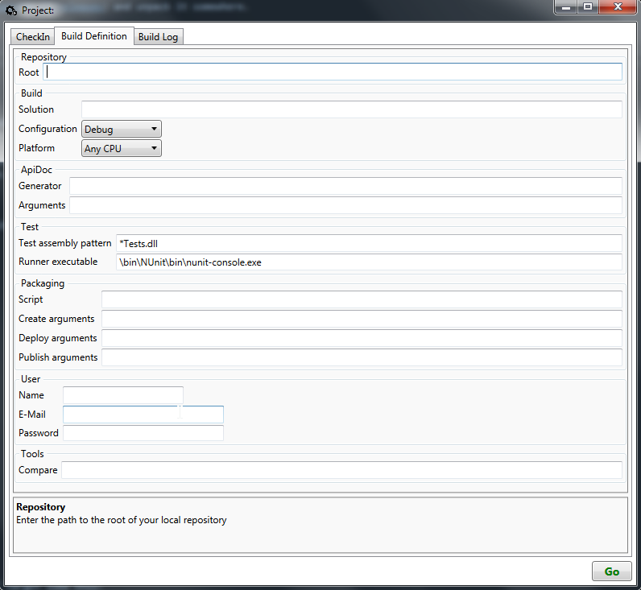

# Getting Started

Download the [latest release](https://github.com/plainionist/Plainion.CI/releases) and unpack it somewhere.

Start Plainion.CI.exe and switch to the "Build Definition" tab.



Fill out the build definition:

- *Repository*
  - *Root*: root directory of your project, e.g.: "D:\Workspace\MyCoolProject""
- *Build*
  - *Solution*: will be detected automatically
  - *Configuration*: change to "Release" (optional)
- *Test* (optional)
  - *Test assembly pattern*: set the naming pattern for your test assemblies, e.g: "*Tests.dll"
  - *Runner executable*: set the full path to your test runner, e.g: "\bin\NUnit\bin\nunit-console.exe"
- *Packaging* (optional)
  - *Script*: set the path to your deployment script, relative to the project root, e.g.: "build\Targets.fsx"
    (See [HowTo conigure the deployment steps?](HowToDeployment.md))
  - *Create arguments*: arguments for your deployment script to create a package, e.g.: "CreatePackage"
  - *Deploy arguments*: arguments for your deployment script to deploy a package on a target location, e.g.: "Deploy"
  - *Publish arguments*: arguments for your deployment script to publish a package on GitHub or NuGet, e.g.: "Publish"
- *User*
  - *Name*: your GitHub user name
  - *E-Mail*: your Git commit e-mail
  - *Password*: your GitHub password (will be stored encrypted!)
- *Tools*
  - *Compare*: configure your favorite diff tool, e.g. ""C:\Program Files\TortoiseHg\kdiff3.exe" %base %mine"

Finally create a "ChangeLog.md" in your project root folder with the following pattern

```
## 1.1.0 - 2017-02-01

- fixed bug: 123345
- added feature XYZ

## 1.0.0 - 2017-01-02

- initial release
```

Now you are READY!

Swtich to the "CheckIn" tab and enable the check boxes for the steps you want to include in your next build.

When you press the GO button the build will start and your configuration will be stored in your project root.

- <Project>.gc stores all non-user related settings. You should check this file in.
- <Project>.gc.<user> stores all user related settings. Usually you dont check in that file.

DONE ... your personal "micro deployment pipeline" is running ;-)
