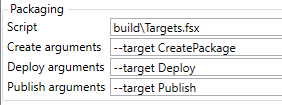

# HowTo configure the deployment steps?

The concrete deployment steps are usually project specific so you have to define them.

Plainion.CI uses [FAKE](https://fake.build/) to support customization of the build process.

Plainion.CI provides various helpers for GitHub and NuGet out of the box.

## Deploying with FAKE

FAKE deployment scripts have to end with ".fsx".
To get started copy the following into your deployment script, e.g. "build\Targets.fsx":

```F#
#r "/bin/Plainion.CI/Fake.Core.Target.dll"
#r "/bin/Plainion.CI/Fake.Core.Trace.dll"
#r "/bin/Plainion.CI/Fake.IO.FileSystem.dll"
#r "/bin/Plainion.CI/Fake.IO.Zip.dll"
#r "/bin/Plainion.CI/Plainion.CI.Tasks.dll"

open Fake.Core
open Fake.IO
open Fake.IO.FileSystemOperators
open Fake.IO.Globbing.Operators
open Plainion.CI

Target.create "CreatePackage" (fun _ ->
    !! ( outputPath </> "*.*Tests.*" )
    ++ ( outputPath </> "*nunit*" )
    ++ ( outputPath </> "*Moq*" )
    ++ ( outputPath </> "TestResult.xml" )
    ++ ( outputPath </> "**/*.pdb" )
    |> File.deleteAll

    PZip.PackRelease()
)

Target.create "Deploy" (fun _ ->
    let releaseDir = @"\bin\MyCoolProject"

    CleanDir releaseDir

    let zip = PZip.GetReleaseFile()
    Unzip releaseDir zip
)

Target.runOrDefault ""
```

*Hint:* Don't forget to adjust the path in the first two lines to your Plainion.CI installation.

The script defines two targets. "CreatePackage" will delete "unwanted" files from your "bin" folder and 
then create a ZIP file under your "bin" folder.
"Deploy" will take the created ZIP and deploy it under the specified "releaseDir".

### Publishing to GitHub

In order to create a new release on GitHub add the following code

```F#
Target.create "Publish" (fun _ ->
    let zip = PZip.GetReleaseFile()
    PGitHub.Release [ zip ]
)
```

above

```F#
Target.runOrDefault ""
```

### Publishing to NuGet

In order to create a new release on NuGet change the "CreatePackage" target to

```F#
Target.Create "CreatePackage" (fun _ ->
    !! ( outputPath </> "*.*Tests.*" )
    ++ ( outputPath </> "*nunit*" )
    ++ ( outputPath </> "*Moq*" )
    ++ ( outputPath </> "TestResult.xml" )
    ++ ( outputPath </> "**/*.pdb" )
    |> File.deleteAll

    [
        ( projectName + ".*", Some "lib/NET45", None)
    ]
    |> PNuGet.Pack (projectRoot </> "build" </> projectName + ".nuspec") (projectRoot </> "pkg")
)
```

The "PNuGet.Pack" task will also generate a proper NuGet package spec from your template. Therefore 
copy the following template under "build/<projectname>.nuspec" and adjust it accordingly:

```Xml
<?xml version="1.0"?>
<package >
  <metadata>
    <id>@project@</id>
    <title>@project@</title>
    <version>@build.number@</version>
    <authors>me</authors>
    <owners>also.me</owners>
    <licenseUrl>http://opensource.org/licenses/BSD-3-Clause</licenseUrl>
    <projectUrl>https://github.com/ronin4net/Plainion.CI</projectUrl>
    <requireLicenseAcceptance>false</requireLicenseAcceptance>
    <description>
      this is just a dummy template for testing
    </description>
    <releaseNotes>
      @releaseNotes@
    </releaseNotes>
    @dependencies
    <copyright>Copyright 2016</copyright>
  </metadata>
  @files@
</package>
```

Then add the following code

```F#
Target.Create "Publish" (fun _ ->
    PNuGet.PublishPackage projectName (projectRoot </> "pkg")
)
```

above

```F#
Target.runOrDefault ""
```

*Hint:* Publishing NuGet packages currently only works if you once followed the instructions [here](https://docs.nuget.org/ndocs/create-packages/publish-a-package) 
regarding APIKey and have stored your APIKey with "setApiKey":

```cmd
NuGet.exe setapikey <your api key> -source https://www.nuget.org/api/v2/package
```

## Configuring the custom targets

Configure the created custom targets in the following way:


