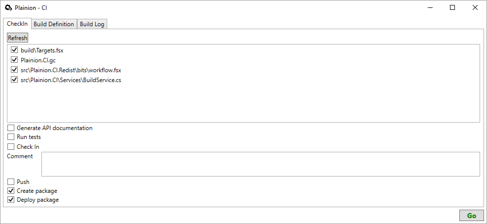

Do you also want to have "continuous delivery" for your hobby project? 
Short cycle times? Fully automated?
But the established solutions seem to be overkill for your one-man project?

Try out Plainion.CI - your personal "micro deployment pipeline"!

## Installation

- download the [latest release](https://github.com/plainionist/Plainion.CI/releases) and unpack it somewhere
- start the Plainion.CI.exe

## Usage

Start the tool and enter all relevant information under the "build definition" tab.
Then change to CheckIn tab, select the files you want to commit and enter a commit message and press "go".

After the first start a (your project).gc file will be placed in your projects root. 
Configure Windows to open Plainion.CI on double click next time.

## Hints

* specify package creation and deployment scripts relative to project root
* use "-" in you ChangeLog.md for bullet lists - other bullet list signs currently not supported

